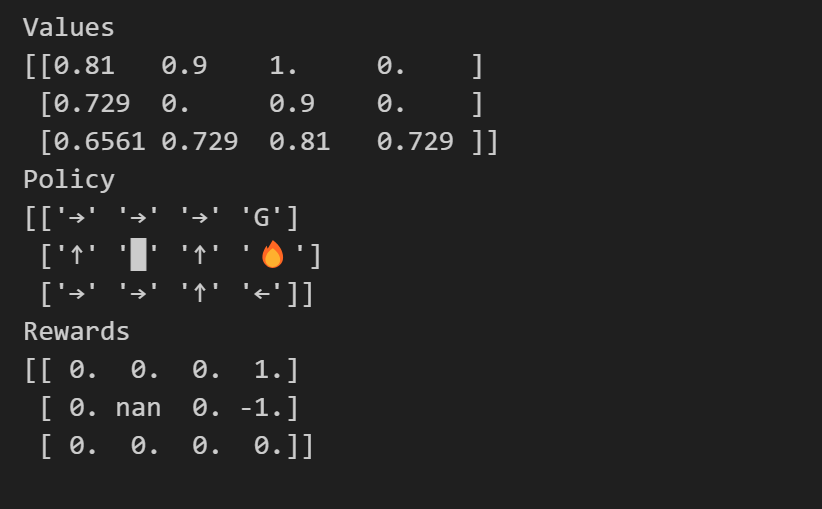

# Apprentissage par Renforcement avec l'Équation de Bellman sur GridWorld

## Description
Ce projet implémente l'algorithme **Value Iteration** pour résoudre un problème de **GridWorld** en utilisant l'équation de Bellman.

L'agent commence en position **(0,0)** et doit atteindre l'objectif **(3,3)** dans une grille de **4x4** tout en évitant les obstacles et les cases dangereuses. L'objectif est de maximiser la valeur de l'état en suivant la meilleure politique de déplacement.

## Règles du GridWorld
- L'agent peut se déplacer dans **quatre directions** : **haut, bas, gauche, droite**.
- Chaque déplacement entraîne une **récompense** (incitant à choisir le chemin le plus court).
- Atteindre l'objectif donne une **récompense de +10** et termine l'épisode.
- Certaines cases peuvent être des **obstacles infranchissables**.
- Une case feu entraîne une **récompense négative (-1)**.

## Équation de Bellman
La mise à jour des valeurs d'état suit l'équation :

\[ V(s) = \max_a \left( R(s, a) + \gamma V(s') \right) \]

où :
- \( V(s) \) est la valeur de l'état \( s \),
- \( R(s, a) \) est la récompense pour l'action \( a \) depuis \( s \),
- \( \gamma \) est le facteur d'actualisation (ici \( 0.9 \)),
- \( V(s') \) est la valeur de l'état suivant.

## Implémentation en Python
Le code suivant implémente **Value Iteration** sur la grille définie :

```python
import numpy as np

# Paramètres
gamma = 0.9
rows, cols = 3, 4  # Taille de la grille
goal_state = (0, 3)
fire_state = (1, 3)
obstacle = (1, 1)
reward_goal = 1
reward_fire = -1
reward_step = 0  # Encourage le chemin le plus court

# Initialisation des valeurs des états et des récompenses
V = np.zeros((rows, cols))
policy = np.full((rows, cols),' ', dtype=str)
rewards = np.full((rows, cols), reward_step, dtype=float)
rewards[goal_state] = reward_goal
rewards[fire_state] = reward_fire
rewards[obstacle] = None  # Obstacle infranchissable

# Déplacements possibles et leurs représentations
actions = [(-1, 0), (1, 0), (0, -1), (0, 1)]  # Haut, Bas, Gauche, Droite
action_symbols = {(-1, 0): '↑', (1, 0): '↓', (0, -1): '←', (0, 1): '→'}

# Algorithme de Value Iteration
def value_iteration(V, rewards, gamma, policy, iterations=100):
    for _ in range(iterations):
        new_V = np.copy(V)
        new_policy = np.copy(policy)
        for i in range(rows):
            for j in range(cols):
                if (i, j) in [goal_state, fire_state, obstacle]:  # États terminaux ou obstacles
                    continue
                values = []
                for action in actions:
                    ni, nj = i + action[0], j + action[1]
                    if 0 <= ni < rows and 0 <= nj < cols and (ni, nj) != obstacle:
                        values.append((rewards[(ni, nj)] + gamma * V[ni, nj], action_symbols[action]))
                if values:
                    new_V[i, j], new_policy[i, j] = max(values)
        V = new_V
        policy = new_policy
        policy[goal_state] = 'G'
        policy[fire_state] = '🔥'
        policy[obstacle] = '█'
    return V, policy

# Exécution des algorithmes
V, policy = value_iteration(V, rewards, gamma, policy)

print(V)
print(policy)
print(rewards)
```

## Résultats
Le programme affiche :
1. La **valeur de chaque état** après l'itération de Bellman.
2. La **politique optimale** (direction à suivre dans chaque case).
3. La **grille des récompenses** avec l'objectif, les obstacles et le feu.




## Dépendances
- Python 3.x
- `numpy`

Installez les dépendances avec :
```bash
pip install numpy
```

## Conclusion
Ce projet illustre l'application de **l'algorithme de Value Iteration** pour un problème de navigation dans un environnement à grille, en utilisant l'équation de Bellman pour apprendre une politique optimale.

---
📌 **Améliorations possibles** :
- Ajouter un agent simulé pour suivre la politique apprise.
- Tester avec d'autres configurations de grilles.
- Implémenter **Policy Iteration** pour comparer les performances.


